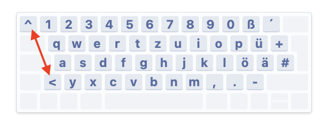
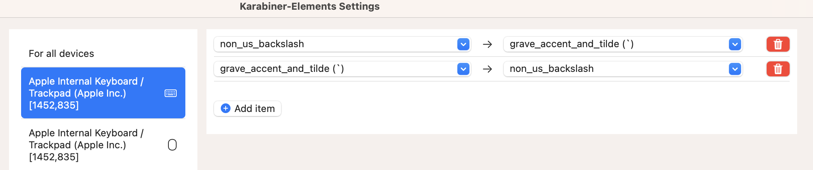

# karabiner-ms-natural-4000

Provides complex rules for [Karabiner Elements](https://karabiner-elements.pqrs.org/) to map some keys on the _Microsoft Natural Keyboard 4000 German_ to the keyboard layout on it.

It provides separate rules for the mapping of:

- at `@` - mapped to option + `q`
- backslash `\` - mapped to option + `ß`
- tilde `~` - mapped to option + `+`
- pipe `|` - mapped to option + `<`
- braces `{` `[` `]` `}` - mapped to option + `7` `8` `9` `0`

The mapping is defined for both option keys - left and right.

## Installation

- install Karabiner Elements
- copy the file `ms_natural_4000_german.json` to `.config/karabiner/assets/complex_modifications`
- (optional) swap the order of the windows and Alt keys; and Alt Gr and application keys - after doing this the order of the option and command key is the same as on a mac keyboard. 
- (optional) On the __internal__ keyboard the keys (see picture) are swapped (key bottom left results in '^' instead of '<'). 
  
  With the following setting both keys are swapped back and behave like the external keyboard.
 
  
## Used/Tested on

- macOS Sonoma 14.4.1 with Karabiner Elements version 14.13.0
- macOS Ventura 13.4 with Karabiner Elements version 14.12.0
- macOS Montery with Karabiner Elements version 14.3
- macOS High Sierra with Karabiner Elements version 12.10
